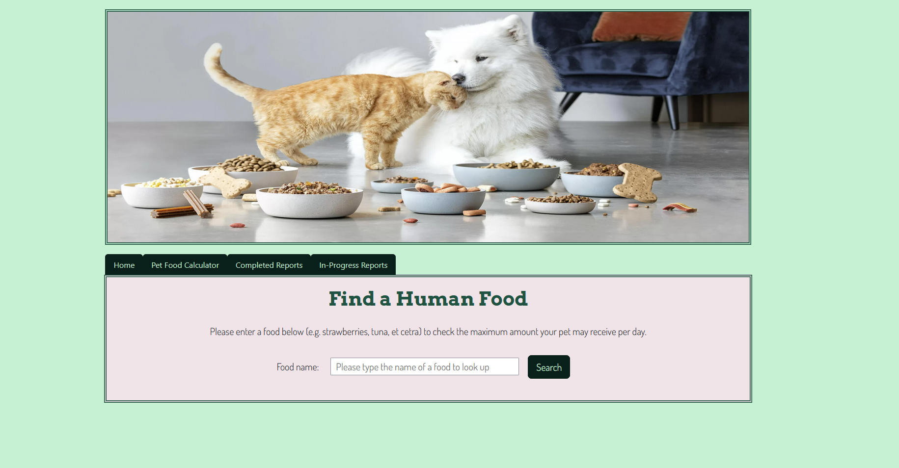
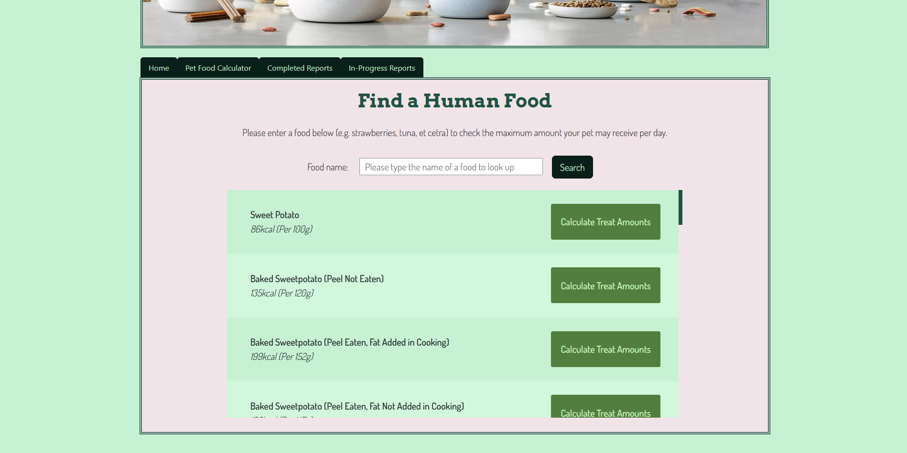
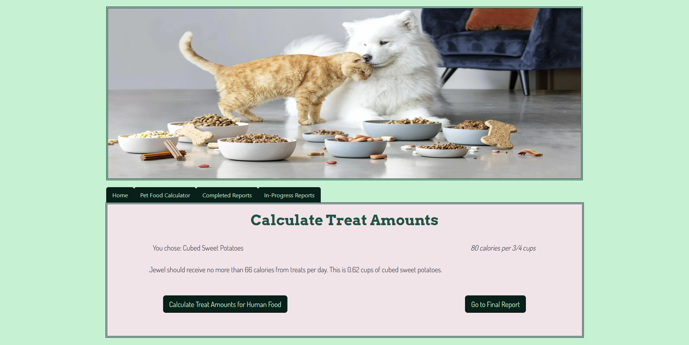

# PET FOOD CALCULATOR

## Video Demo: <[Pet Food Calculator](https://youtu.be/GNHv3KKURjY)>

## Description

Welcome to the Pet Food Calculator! This is an open source Flask web application that allows you to input your pet's information and get recommended feeding amounts. It will also provide specific recommendations based on your pet's life stage.

When changing your pet from one food to another, it is important to do a slow transition over 5-14 days (the actual time depends on how sensitive your pet's stomach is, though generally, the transition period is 5-7 days).

- [Project Structure](https://github.com/jasmine-glancy/PetFoodCalculator/blob/main/README_DIR/PROJECT_STRUCTURE_README.md)
- [Future Version Goals](https://github.com/jasmine-glancy/PetFoodCalculator/blob/main/README_DIR/TODO_README.md)

Please email [jasmine.glancy.vt@gmail.com](mailto:jasmine.glancy.vt@gmail.com) or submit a pull request if you would like to contribute. I'd love to collaborate. Thank you for your consideration!

### Credits

#### Images

- Canine and feline BCS image credit to [McLean Animal Hospital](https://www.mcleanvet.com/know-pet-good-weight/)
- Canine and feline puzzle toy images credited to their respective Chewy.com pages
  - [Canine](https://www.chewy.com/brightkins-dj-doggo-puzzle-feeder-dog/dp/930046)
  - [Feline](https://www.chewy.com/doc-phoebes-cat-co-indoor-hunting-cat/dp/179101)

#### SVGs

- All cat and dog SVGs credited to [WallArtBox on Etsy](https://www.etsy.com/shop/wallartbox)
- Dog paw, cat paw, food bowl, and pet food bag SVGs credited to [RostoumArt on Etsy](https://www.etsy.com/shop/RostoumArt)

## Version 2 (completed 9/3/24)

### Treat Calculator

The portfolio project for day 96 of [100 Days of Code: The Complete Python Pro Bootcamp](https://www.udemy.com/course/100-days-of-code). The goal was to create a web application based on an API we found interesting. I chose the API from [FatSecret](https://platform.fatsecret.com/) because I wanted to to see the caloric information of various human foods. Using this information, the Pet Food Calculator calculates how much of a chosen human food they can receive per day without unbalancing their diet. Treat amounts are between 8-10% of a pet's resting energy requirements.

#### Choosing a Human Food

The user can choose the food that they want to calculate for by clicking the "Calculate Treat Amounts" button.

#### Final Treat Page Result

The final treat calculation page provides a reminder of the max amount of calories a pet can have per day from treats without unbalancing their diet. If there is more than a certain amount of a type of treat, users are cautioned to ensure with their vet that there will be no expected side effects or potential health issues.
